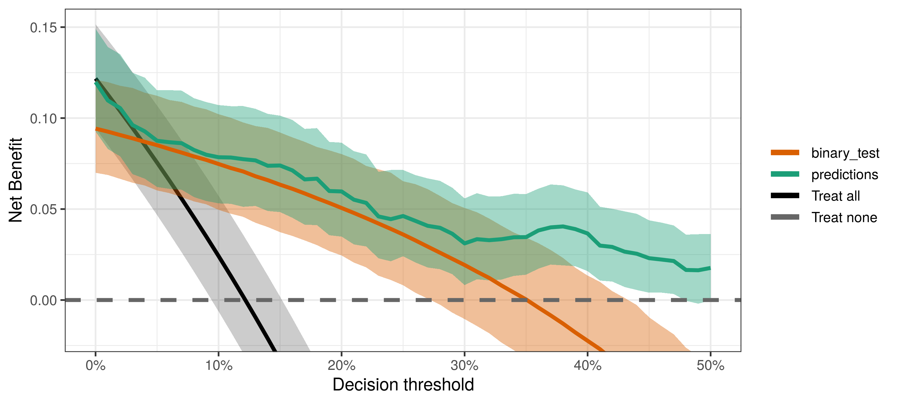
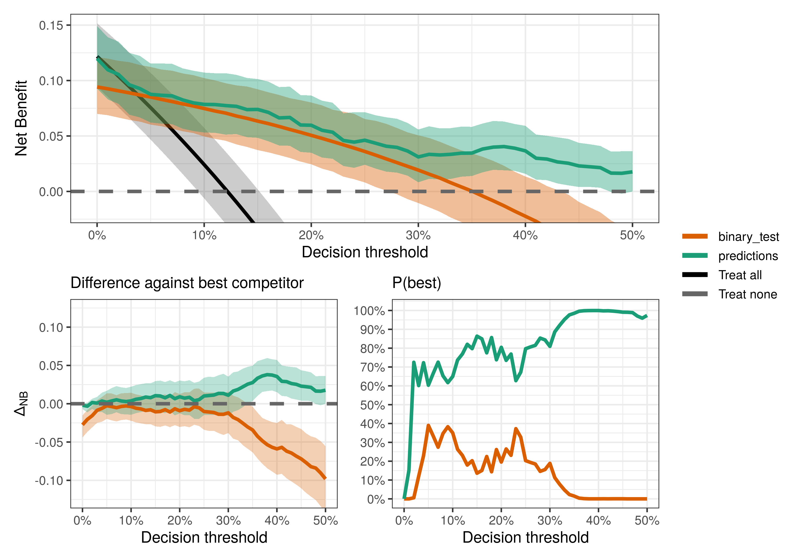
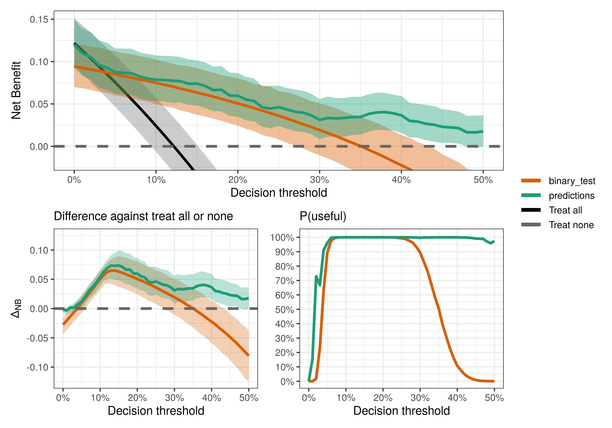
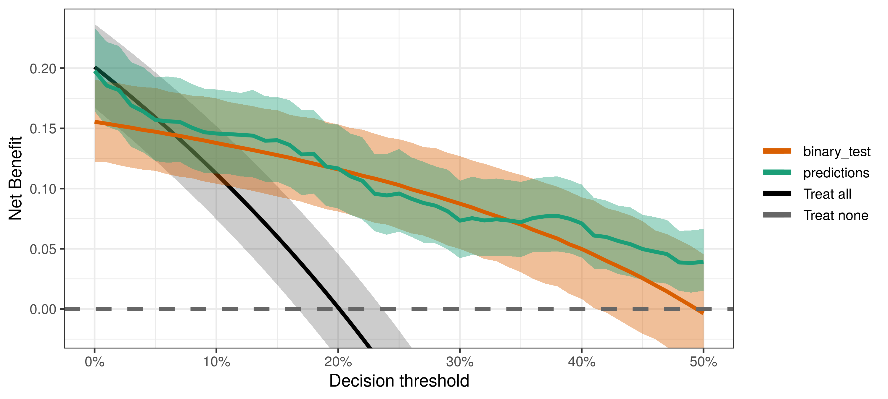

<!-- README.md is generated from README.Rmd. Please edit that file -->

# bayesDCA

<!-- badges: start -->

[](https://lifecycle.r-lib.org/articles/stages.html#experimental)
<!-- badges: end -->

Perform Bayesian Decision Curve Analysis for clinical prediction models
and diagnostic tests.

When validating a clinical prediction model, you may end up with AUC
0.79 and a slight miscalibration. How do you know if that is good enough
for your model to be clinically useful? The same question can be asked
if you have, for instance, a binary diagnostic test with sensitivity of
75% and specificity of 68%. Decision Curve Analysis helps us find an
answer - see [Vickers, van Calster & Steyerberg,
2019](https://diagnprognres.biomedcentral.com/articles/10.1186/s41512-019-0064-7)
for an introduction to DCA. Here, we use Bayesian methods to accurately
quantify uncertainty in our decisions curves - powered by
[Stan](https://mc-stan.org/).

# Installation

You can install the development version of bayesDCA from
[GitHub](https://github.com/) with:

``` r
# install.packages("devtools")
devtools::install_github("giulianonetto/bayesdca")
```

# Running Bayesian DCA

You can use `bayesDCA` to evaluate predictive models as well as binary
tests.

All you need is a `data.frame` with a column named `outcomes` (0 or 1)
and one column for each model or test being evaluated. In the example
below, the `PredModelData` includes the probability predictions from a
model (`"predictions" column`) and the results from a binary test
(`"binary_test"` column). The names of these columns don’t matter
(except for the `outcomes` column, which should always be present).

``` r
library(bayesDCA)
data(PredModelData)
head(PredModelData)
#>   outcomes predictions binary_test
#> 1        0  0.01280653           0
#> 2        0  0.13981948           0
#> 3        0  0.03566458           0
#> 4        0  0.02351731           0
#> 5        0  0.00863298           0
#> 6        0  0.00959754           0
```

We set `cores = 4` to speed up MCMC sampling with
[Stan](https://mc-stan.org/).

``` r
fit <- dca(PredModelData, cores = 4)
plot(fit)
```

<!-- -->

# Interpreting Bayesian DCA

Each decision curve represents the predictive performance of a decision
strategy – yes, treating all (or none) is a valid decision strategy.
Given the estimated decision curves, we may want to ask several
questions, such as:

-   What is the best decision strategy?
-   Are the strategies based on predictive models or tests useful *at
    all*?
-   Is the predictive model guaranteed to be better than the binary
    test?
-   What is the consequence of the uncertainty imposed by the available
    data?

The `bayesDCA` R package provides an easy workflow for answering these
questions. In particular, the “DCA part” of Bayesian DCA allows
answering the first three questions; adding the “Bayesian part” allows
quantifying uncertainty around those answers.

The best decision strategy is the one that maximizes the observed net
benefit. However, if the uncertainty is large, more data may be
necessary to increase confidence in our conclusions. The fourth question
directly quantifies what we might lose, in terms of net benefit, by
drawing conclusions under the current level of uncertainty.

### What is the best decision strategy?

Say you want to infer what is the best decision strategy among the
prediction model, the binary test, and the default strategies (treat
all/none). You can then compare the decision curves:

``` r
compare_dca(fit, type = "best")
```

<!-- -->

For most decision thresholds, the model predictions maximize the
observed net benefit (i.e., have the highest posterior means) and hence
is the best decision strategy given the available data. However, notice
that uncertainty is quite large at least for thresholds below 30%, where
conclusions might be noisy and more data could be beneficial.

### Are the prediction model or the binary test useful at all?

Well, maybe not everyone has access to both the prediction model and the
binary test. But is each of them useful at all? Here, “useful” means
better than the default strategies (treat all/none), following the
definition in [Wynants et
al. (2018)](https://pubmed.ncbi.nlm.nih.gov/29575170/).

``` r
compare_dca(fit, type = "useful")
```

<!-- -->

### Is the model better than the test?

We can also do pairwise comparisons by specifying the pair of strategies
we want to compare with the `models_or_tests` argument (set it to a
single value to compare it against default strategies).

``` r
compare_dca(fit, 
            models_or_tests = c("predictions", "binary_test"), 
            type = "pairwise")
```

<!-- -->

### What is the consequence of uncertainty?

To answer that, we need an estimate of the *Expected Value of Perfect
Information* (EVPI) for model validation as defined in [Sadatsafavi et
al. (2022)](https://arxiv.org/abs/2208.03343). You may think of this as
the price or consequence of uncertainty. Since we only have a sample
dataset, we don’t know for sure what is the best decision strategy for
each threshold. The EVPI quantifies the expected loss in net benefit
associated with that uncertainty. If it is high for a given threshold,
then we would greatly benefit from more data to validate our decision
strategies.

``` r
compare_dca(fit, .evpi = TRUE)
```

<!-- -->

Notice that the EVPI follows closely the uncertainty around the best
strategy: the larger the uncertainty, the more we are expected to
benefit from accessing “perfect information”.

# Using external information to estimate prevalence

Say you are validating tests using a nested case-control study, so the
prevalence parameter must come from the larger sample from which cases
and controls were selected. Another example is when you want to use an
external estimate of prevalence (say from a large prospective
cross-sectional study). You can do so by passing the
`external_prevalence_data` argument to `dca`.

``` r
fit <- dca(PredModelData, cores = 4,
           external_prevalence_data = c(100, 500))
plot(fit)
```

<!-- -->

Notice also that the `external_prevalence_data` information is used only
to estimate the prevalence, which is then used in the net benefit
calculation. Sensitivity and specificity use the original information in
`PredModelData`.
